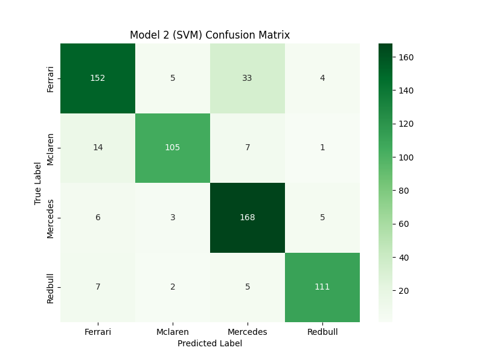

# F1 Car Computer Vision Model

### 1. Description

* This project addresses a computer vision task. The goal of this project, train a model that can accurately identify an F1 car's team from an image.
* Domain Computer Vision (Image-based Classification).
* The goal is to classify F1 car images into four teams: Ferrari, McLaren, Mercedes, and Red Bull using two different machine learning models (one DL, one classic ML).
* Overview of the Results: The highest validation accuracy (85.35%) was attained by a hybrid model that used an SVM as a classifier and a CNN as a feature extractor.

---

### 2. Dataset

* Source  The dataset used is the "F1 Car Classification" dataset from Roboflow Universe.
* Data Size the dataset contains two splits, loaded from CSV files (_classes.csv):
    * Training: 6657 validated image filenames.
    * Validation: 628 validated image filenames.
* **Preprocessing & Augmentation:**
    * All images are resized to 224x224 pixels to fit the base model's input dimensions.
    * Pixel values normalized to a [0, 1] range by dividing by 255.
    * The training data generator applied random augmentations to improve model generalization:
        * Rotation (20 degrees)
        * Width/Height Shift (0.2)
        * Shear (0.2)
        * Zoom (0.2)
        * Horizontal Flip

---

### 3. Methods

Two models were taken for a comparative analysis.

#### Model 1: End-to-End Deep Learning (CNN)
* Transfer Learning with MobileNetV2 (a Convolutional Neural Network).
* The pre-trained MobileNetV2 base (trained on ImageNet) was loaded with include_top=False.
* The base model's layers are frozen (base_model.trainable = False) so only the new classifier head would be trained.
* A new head was added:
    * GlobalAveragePooling2D() layer (to flatten features).
    * Dense(4, activation='softmax') layer (for 4-class classification).
* Training the model was mixed with adam optimizer and categorical_crossentropy loss. It was trained for 5 epochs.

#### Model 2: Hybrid Model (CNN as Feature Extractor + SVM)
* Architecture: MobileNetV2 (as feature extractor) + Support Vector Machine (SVM) (as classifier).
* The trained base_model from Model 1 (up to the GlobalAveragePooling2D layer) was used as a feature extractor.
* Both the training (6657) and validation (628) datasets were passed through this extractor. This converted each 224x224 image into a 1280-dimension feature vector.
* A usual Support Vector Classifier (SVC) from scikit-learn is initialized (kernel='rbf').
* The SVM is trained on extracted feature vectors (features_train) and also their corresponding labels (labels_train).

---

### 4. Steps to Run Code
* In environment used to run the code we had a T4 GPU runtime.
* Install Dependencies: Run the first code cell to install roboflow, tensorflow, scikit-learn, pandas, and seaborn.
* API Key: The notebook uses a hardcoded API key from RoboFlow to download the dataset automatically thought the API we needed to provide a Link to of the Dataset.
* Run all cells in the notebook in order from top. 
* The script will download data, train Model 1, train Model 2, and generate all comparison charts and reports between model 1 and 2.

---

### 5. Experiments & Results
The performance of both models was evaluated on the 628-image validation set.

#### Performance Metrics
| Model | Type | Validation Accuracy |
| :--- | :--- | :--- |
| Model 1 | End-to-End CNN | 80.10% |
| Model 2 | Hybrid (CNN+SVM) | 85.35% |

#### Model 1 (CNN) Results
* Accuracy: 80.10%.
* Loss/Accuracy Curves: The training and validation loss/accuracy curves are generated by the notebook on the runtime.
* Confusion Matrix, CNN model showed the most confusion between Ferrari and Mercedes, and also misclassified some Red Bull cars as Mercedes.
* **F1-Scores (per class):**
    * Ferrari: 0.75
    * McLaren: 0.82
    * Mercedes: 0.81
    * Red Bull: 0.83

#### Model 2 (SVM) Results
* Accuracy: 85.35%.
* **Classification Report (Model 2):**
    ```
                  precision    recall  f1-score   support

         Ferrari       0.85      0.78      0.82       194
         Mclaren       0.91      0.83      0.87       127
        Mercedes       0.79      0.92      0.85       182
         Redbull       0.92      0.89      0.90       125

        accuracy                           0.85       628
       macro avg       0.87      0.86      0.86       628
    weighted avg       0.86      0.85      0.85       628
    ```
* **Analysis:** The SVM classifier *improved* performance across all classes. The F1-score for **Ferrari** jumped significantly from 0.75 to 0.82. The model was strongest at identifying **Red Bull** (0.90 F1-score) and showed a much better balance of precision and recall overall.
* **Confusion Matrix (Model 2):**
    
* Confusion Matrix: The SVM model showed significant improvement. Misclassifications were reduced across all classes, especially for Ferrari.
* **F1-Scores (per class):**
    * Ferrari: 0.82
    * McLaren: 0.87
    * Mercedes: 0.85
    * Red Bull: 0.90

(Note: All comparison charts are generated in the .ipynb notebook output.)

---

### 6. Conclusion
* Two models were successfully used and compared. The hybrid (CNN+SVM) model was the one which outperform the end-to-end CNN model by over 5% in accuracy.
* This tells that while MobileNetV2 is an excellent feature extractor, the SVM with an RBF kernel is a more powerful and effective classifier for this specific dataset than the CNN's default Dense layer.
* The SVM model is strongest at identifying Red Bull (0.90 F1-Score) and weakest at identifying Ferrari (0.82 F1-Score), though it was still a significant improvement over the CNN's 0.75 F1-Score for Ferrari.

---

### 7. References
* Dataset: F1 Car Classification.->
* Roboflow Universe. (https://universe.roboflow.com/f1-car-detection-model/f1-car-classification)
* Libraries: TensorFlow/Keras, Scikit-learn, Pandas, Roboflow.
